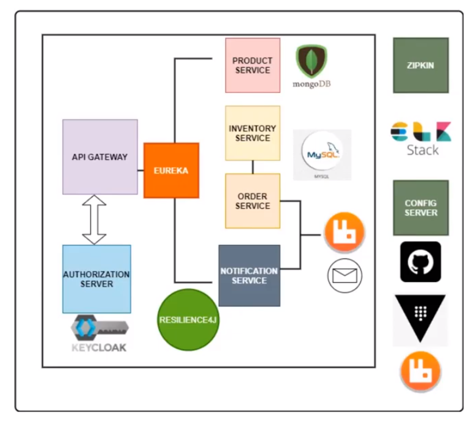
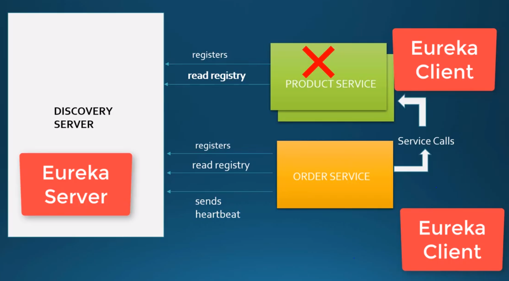

# Some Definitions First :

## Microservice VS Monolithic aproach

## Microservice VS Monolithic architecture 

## Microservice architecture promotes “easy manageability”. How? 

Easy manageability by 
- Having modules that can be 
    * designed and implemented in any order
    * developed and maintained by separate small teams
    * tested independently
    * deployed independently
    * easily evolve over time with more features, enhancements, and bug fixes
    * made scalable and resilient with the help of infrastructure setup only 

- Having plug and play design which means
    * modules can be upgraded, replicated without making zero change impact on each others

- Having automation that provides
    * continuous integration → providing new and better version of the module when available
    * continuous testing → executing code static analysis, dynamic analysis, functional and integration testing, and failing builds that do not made up to the required standard
    * continuous deployment → providing deployment of new builds which will also include upgrading the existing ones
    * continuous monitoring → aggregating module execution logs, it performance and health metrics and doing analysis over them to determine system wide issues

## Common design patterns for distributed systems: 
- Communication orchestration
- Externalizing configuration
- Service discovery
- Load balancing
- Service orchestration
- Circuit breakers
- Intelligent routing
- Micro-proxy
- Control bus
- One-time tokens
- Global locks
- Leadership election
- Distributed sessions
- Cluster state
- Centralized accounting

## Components of a microservices architecture :

## Architecture microservices avec Spring Cloud

# Project 
- This project aims to build an online shopping application using springboot microcervices. 

Bellow is the application architecture :

- we implement 4 services :

`1. Product service :`expose REST APIs backed by mongodb, it take care of the product configuration.

`2. Order service :`expose REST APIs backed by mysql db, it takes care of processing the orders placed by the users. As part of order processiong, we make a synchronous communication with the inventory service, a resilient communication using the resilience 4j library (why ? : because if for some reasons, order service is calling the inventory service but this inventory service is not responding. In this case instead of continuously calling the inventory service, we will excute a fallback lofgic where we handle this failure gracefully and inform the upstream microservices that the inventory is down => that's called as a circuit breaker pattern).

`3. Inventory service :`expose REST APIs backed by mysql db, it takes care of inventory means verify if product is in stock or not before the customer order a product

`4. Notification service :`we perform asynchronous communication using event driven architecture so as soon as the order is placed, we fire an event and the notification service will listen to this event and then send an order notification to the customers.

- we make use of API gateway microservice so that all the requests will be routed to the corresponding services.
- we secure our microservicees using the keyCloak authorization server.
- we use spring-cloud-netflix-eureka module as the service registry and discovery service to enable service to service communication with hardcoding the service info inside one another.  
- we use a config server as a centralized config server backed in git repositroy that maintain all the services properties. 
- we use the Zipkin to implement distributed tracing the request chain and also the response time for each service.
- we use elasticsearch logstash and kibana to implement centralized logging so that we aceess the logs of all the services at one place.

## Discovery Server :
- Imagine if from our order-service we are calling the product-service REST API so we need to manually hard code the hostname or url of the product service inside the order-service.
It's very common in microservice architecture to make the service highly available and it can have multiple instances, so here we need to harcode the hstname of thoses extra instances in he order-service.
- Imagine if we have hundreds of services ?
It's absurde to do that so the strategy will not work.
What we need is an automatic detection of all the available services in our network => this is called Service Discovery : a central place where all the other services will come and register themselves for example using a name and then the discovery server will maintain live overview of all the available services.
This process of services registering themselves with the Discovery Server is called as Service Registery.

- In the example bellow, product-service and order-service will register them self with the Discovery Server and the retreive and store a copy of this registry in their local cache.
- So in this way if the order-service wants to make a call to a product-service, it already knows where it is.
And if the product-service has multiple instances, it will do some client-side load balancing and will call one of the available instances.

#### So now how will the discovery server know if the service instance is down or not ?
- So after registering themselves, the clients will send continous heartbeat requests to the discovery server.

- And if the server did not receive any hard bit requests from the clients it will mark it as down.

#### How to implement this server/client functionality ?
Spring Cloud introduced the Spring Cloud Eureka Project which contains the implementation for the spring cloud eureka server and the spring cloud eureka client.

##### Discovery Server Side:
`1. ` Add to the project the dependency : Eureka Server : To be able to implement Spring cloud Discovery. 

`2. ` Add @EnableEurekaServer in the main class.

`3. ` Configure a port where the eureka server should run(frequently usedd port = 8761). 

##### Client/Service Side :
`1. ` Include spring-cloud-starter-netflix-eureka-client dependency for order-service and product-service.

`2. ` Add @EnableEurekaClient in the main class.

`3. ` Clients register with eureka server using a name, so we can configure a spring.application.name property.

`4. ` We also need to set port property to 0 because we need to create multiple instances of the product service so we give responsiblitiy to spring to assign a free port dynamically at the time of startup.

`5. ` If we have multiple instances, we need a way to uniquely identify each instance for that we configure this property eureka.instance.instance-id=${spring.application.name}:${random.uuid} .

## Centralized Configuration throught a configuration-server :
- For example, if we want to change a property in one of the services :

- Beside the fact that we need to take down all the other instances of the service and redoploy it again, But how if we have tones of microservices ?

=> we need a centralized configuration where we can store all our configuration proterties for our microservices and there are any changes to its properties we should be able to dynamically load them to our microservices instead of restarting the insstances.

- Spring cloud introduced  this functionnality using the spring cloud config project where we can store the config in a git repository or we can also store it natively  using local files.

- By providing the url of the git repository,  we can read the properties dynamically whenever they are changed.

##### Create the config server Side:

`1. ` Add this Dependencies to the project : 
    * Config server (Spring Cloud Config): central managment for thhe configuration via Git, Svn ...
    * Spring Boot Actuator : Support built in endpoints that let you monitor and manage application : health, metrics, session..

`2. ` Add @EnableConfigServer to main class.

`3. ` Create the git repository which stores the properties of our microservices then add the configuration from the product and order service to this repository.

`4. ` In properties file : define spring.application.name, server.port=8888 which is the default port for config server and spring.cloud.config.server.git.uri=link to the config git repository.

##### Client/Service Side :
- Order and product server need to point also to the config file to fetch the properties they need :

`1. ` Add dependencies

   *  spring-cloud-config-client
   *  spring-cloud-starter-bootstrap : to hook up the logic to read the properties from our config server when we bootstrap the application and to add the address of the config server through the bootstrap properties file.

`2. ` Add a boootstrap.properties file in which we add prop of the server config git repo.

To visualise the properties, send a Get request to http://localhost:8888/order-service/default or http://localhost:8888/product-service/default.

## Refreshing configuration :
- Goal : If we change a property in the git config file, the test.name property in the product-service.properties file for example, the product-service should be updated dynamically without restaring the service.
- How : by adding the @RefreshScope to the class using that property test.name, add spring-boot-actuator dependency to the service.

Once the  test.name changed in the config server, we send a POST request to http://localhost:PORT/actuator/refresh and the value will be updatedd in the service.
   